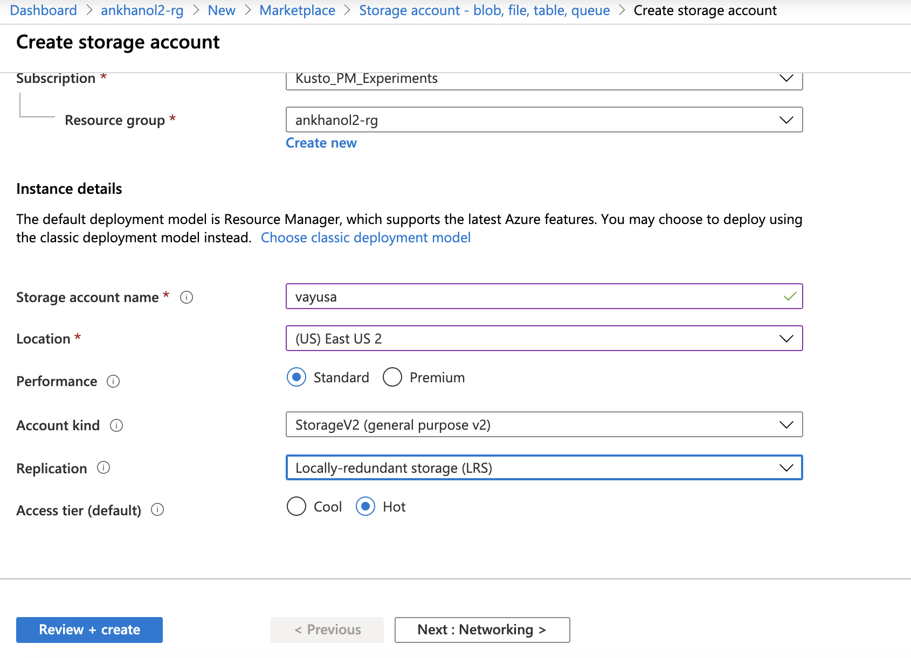
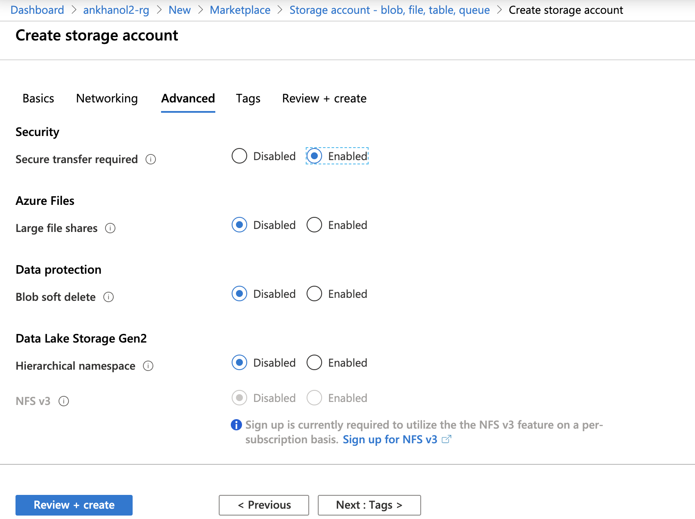
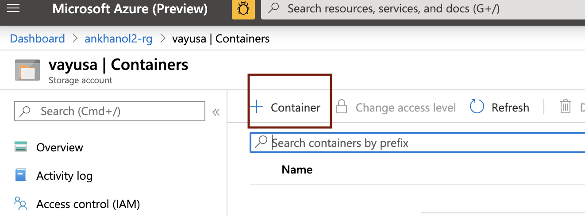

# About

This module covers provisioning of a storage account v2 and containers needed for the lab. 
Navigate to your resource group, and click on "Add" and follow the steps below. 

### 1. Search for "Virtual Network", and click "create"

 

 

### 2. Search for "Virtual Network", and click "create"

 

 

### 3. Search for "Virtual Network", and click "create"

 

 

### 4. Search for "Virtual Network", and click "create"

 

 

### 5. Search for "Virtual Network", and click "create"

 

 

### 6. Search for "Virtual Network", and click "create"

 

 

### 7. Search for "Virtual Network", and click "create"

 

 

### 8. Search for "Virtual Network", and click "create"

 

 

### 9. Search for "Virtual Network", and click "create"

 

 

### 10. Search for "Virtual Network", and click "create"

 

 

### 11. Search for "Virtual Network", and click "create"

 

 

### 12. Search for "Virtual Network", and click "create"

 

 

This concludes the module. 
[Return to the menu](https://github.com/anagha-microsoft/adx-kafkaConnect-hol/tree/master/hdi-standalone-nonesp#lets-get-started)
