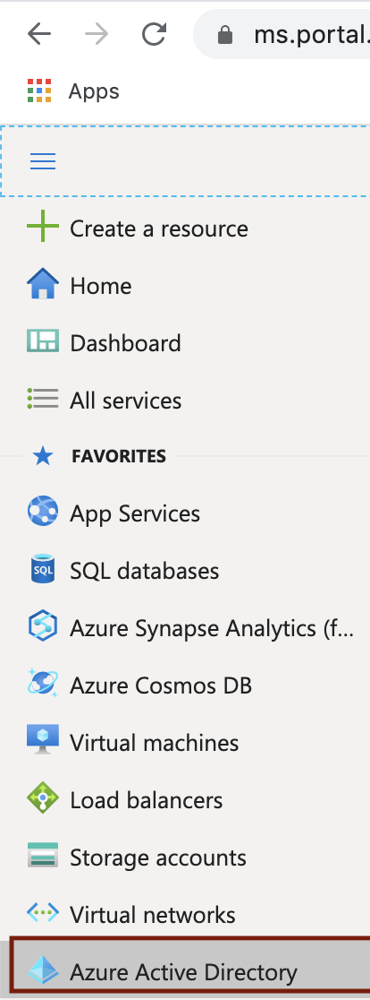
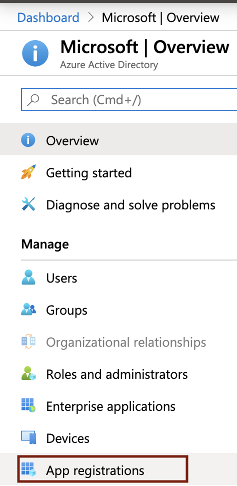
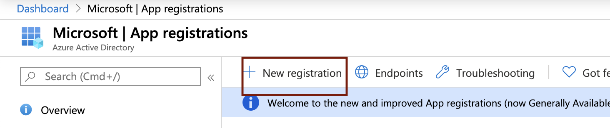
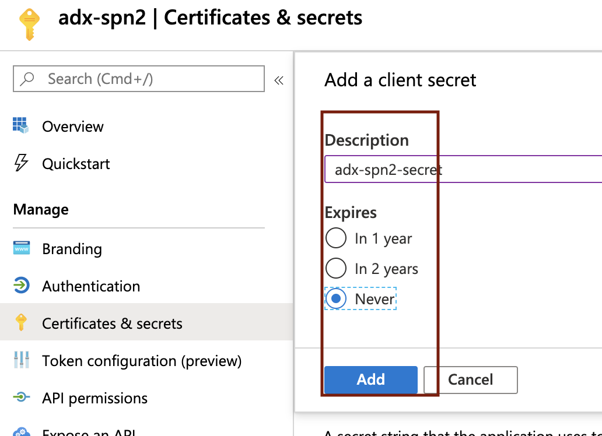
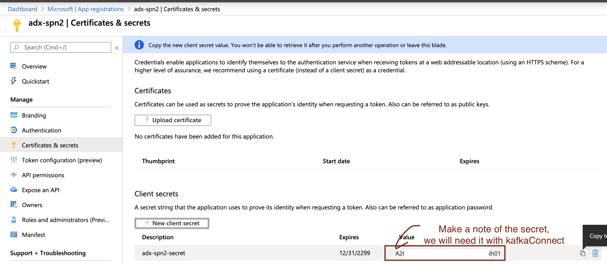
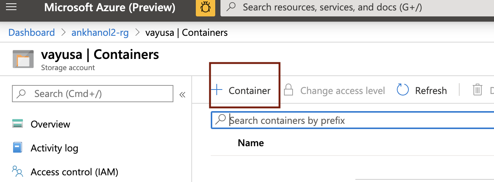

# About

This module covers provisioning an Azure Active Directory (AAD) Service Principal (SPN).  We will grant this SPN, the "ingestor" role in ADX, adn leverage the same to sink to ADX from Kafka   

Navigate to your resource group, and click on "Add" and follow the steps below. 

### 1. Search for "Storage Account"

 

 

### 2. Click "create"

 

 

### 3. Enter details, be sure to select the right resource group and region

 

 

### 4. Select Locally Redundant Storage

 

 

### 5. In the advanced tab, leave defaults

 

 

### 6. Validate and click "create"

 

 

### 7. Once the service is provisioned, click on it in your resource group, we will create containers

 

 

### 8. Click on "Containers"

 

 

### 9. Click on "+Container"

 

 

This concludes the module. 
[Return to the menu](https://github.com/anagha-microsoft/adx-kafkaConnect-hol/tree/master/hdi-standalone-nonesp#lets-get-started)
