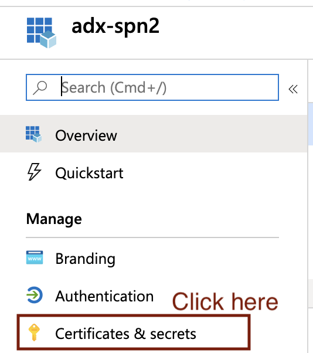
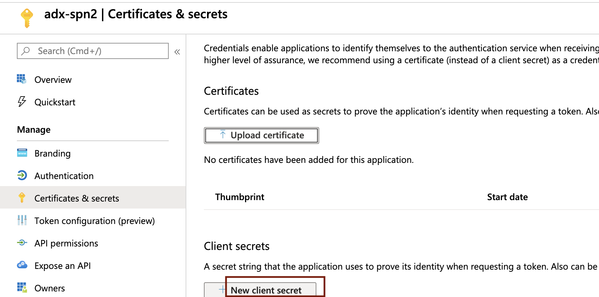

# About

This module covers provisioning an Azure Active Directory (AAD) Service Principal (SPN).  We will grant this SPN, the "ingestor" role in ADX, adn leverage the same to sink to ADX from Kafka   

Navigate to portal.azure.com on your browser and follow the steps below: 

### 1. Click on Azure Active Directory

 

 

### 2. Click on App Registrations

 

 

### 3. Click on New Registration

 

 

### 4. Select Locally Redundant Storage

 

 

### 5. In the advanced tab, leave defaults

 

 

### 6. Validate and click "create"

 

 

### 7. Once the service is provisioned, click on it in your resource group, we will create containers

 

 

### 8. Click on "Containers"

 

 

### 9. Click on "Containers"

 

 

### 9. Click on "+Container"

 

 

This concludes the module. 
[Return to the menu](https://github.com/anagha-microsoft/adx-kafkaConnect-hol/tree/master/hdi-standalone-nonesp#lets-get-started)
