# About

This module covers provisioning an Azure Data Explorer, creating database objects required for the lab and granting permissions.  Navigate to your resource group, and click on "Add" and follow the steps below. 

### 1. Search for "Azure Data Explorer"
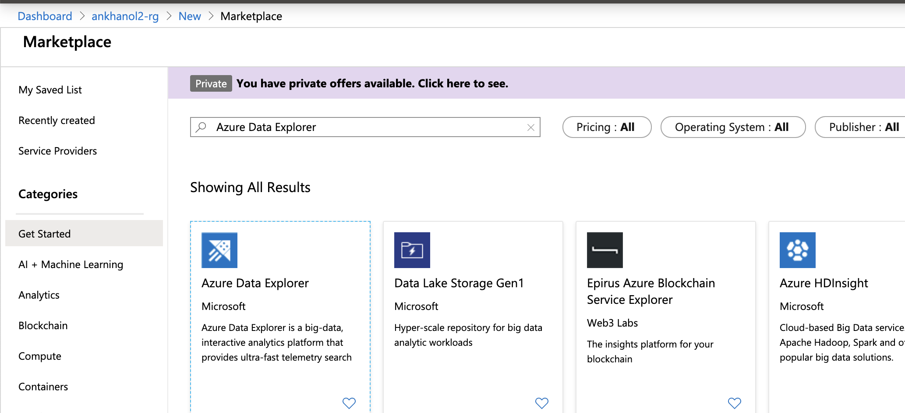
 

 

### 2. Click create

 

 

### 3. Enter details
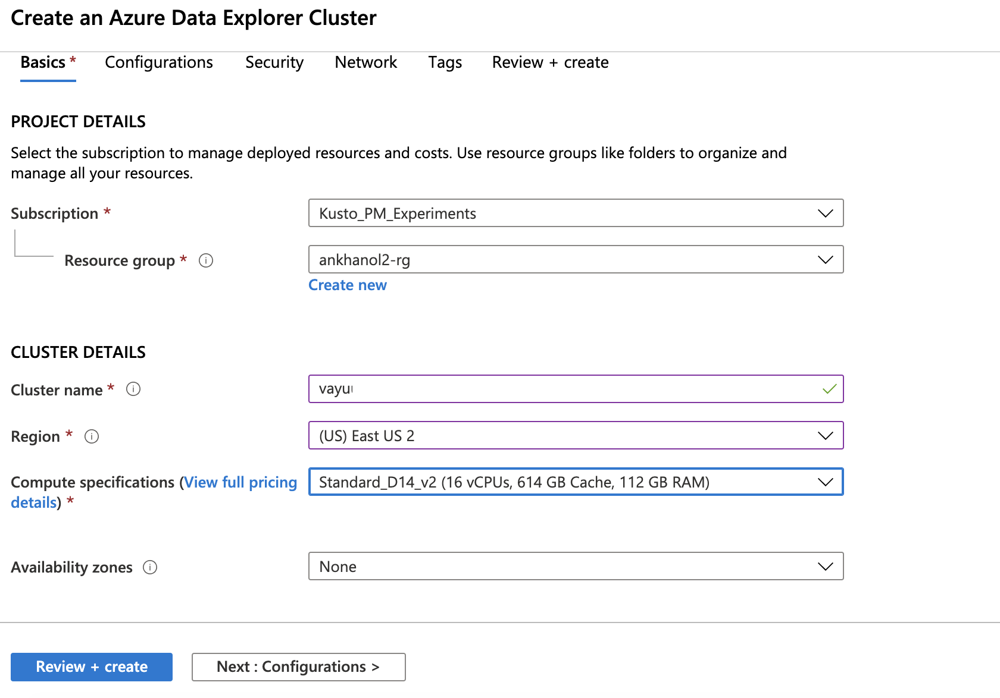
 

 

### 4. Click on the "On" radio button for streaming ingestion
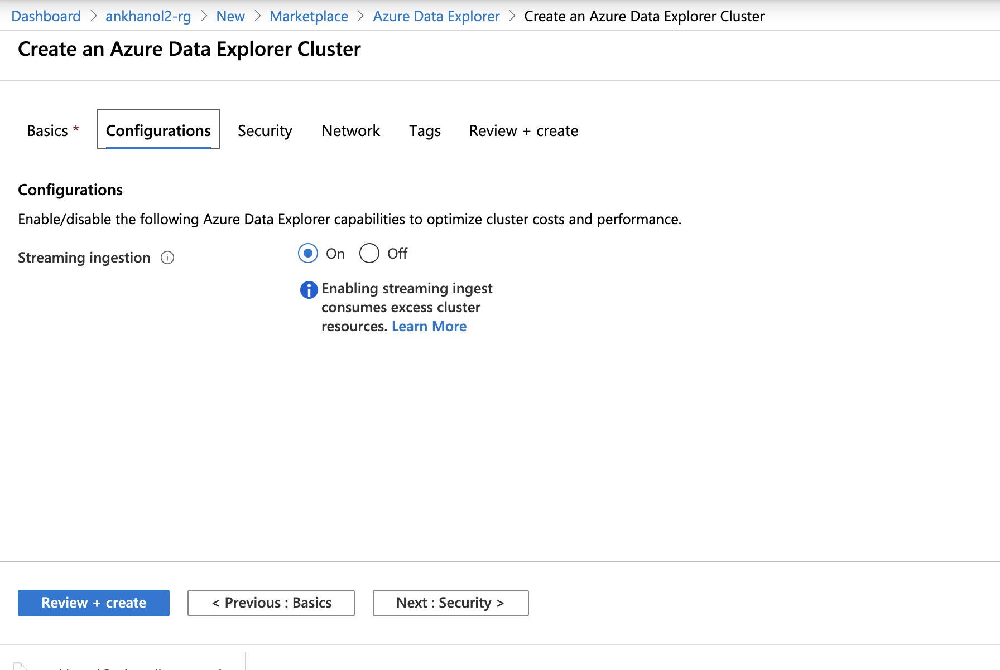
 

 

### 5. Leave defaults

 

 

### 6. Leave defaults

 

 

### 7. Leave defaults
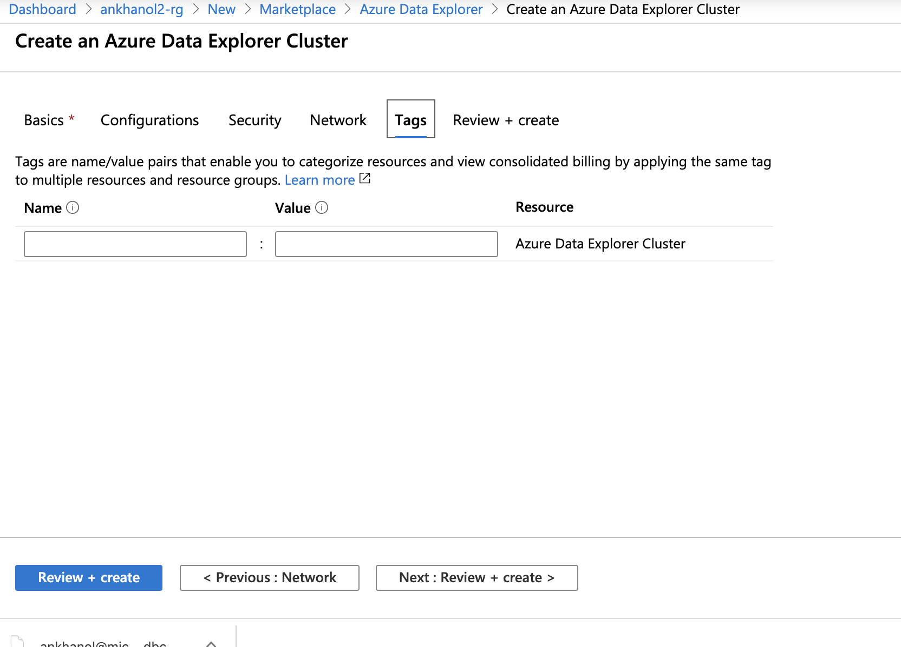
 

 

### 8. Validate and click on "Create"
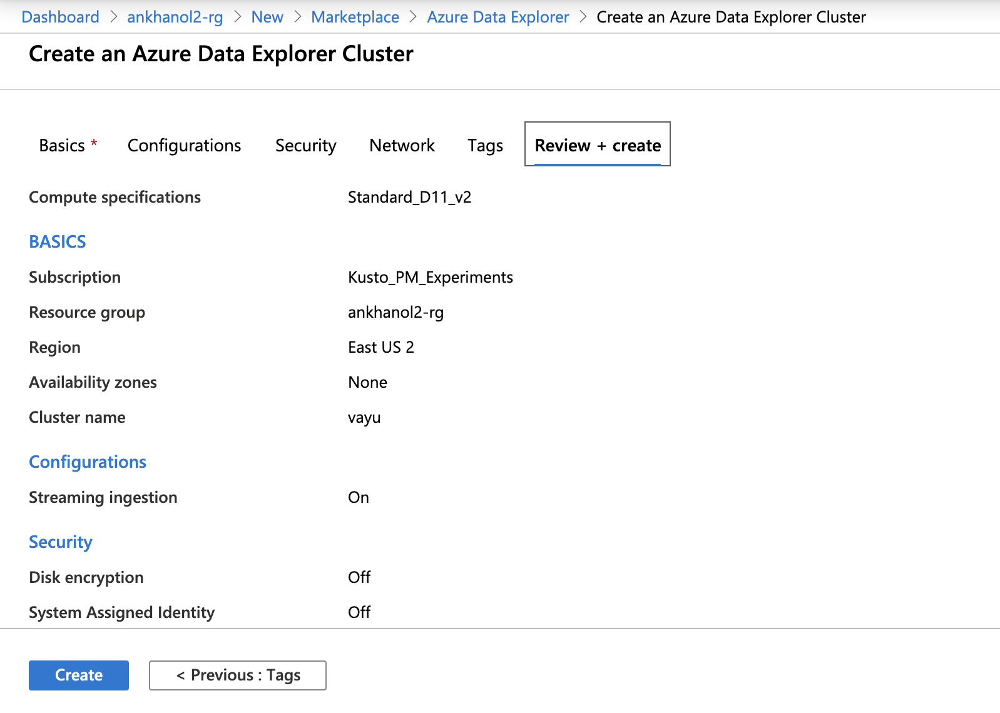
 

 

### 9. Once the cluster is created in your resource group, click on it, and then on "database" - the link is on the left vertical navigation bar.  
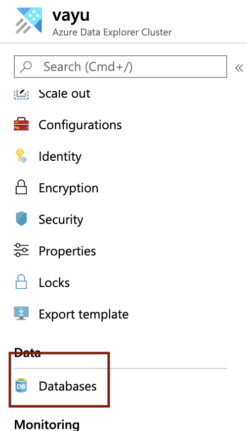
 

 

### 10. Click on "add database".

 

 

### 11. Create a database called "crimes_db"
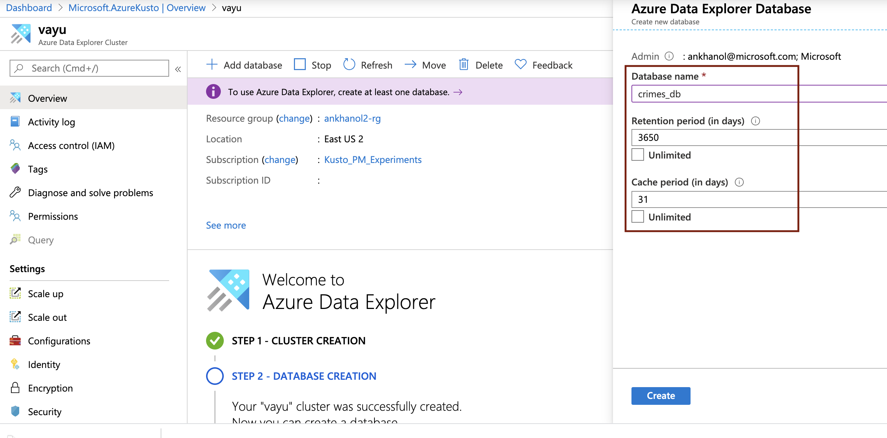
 

 

### 12. You should see the database created.  Click on it.
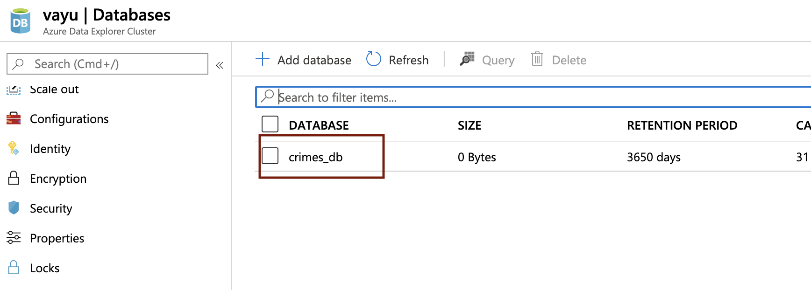
 

 

### 13. Click on query
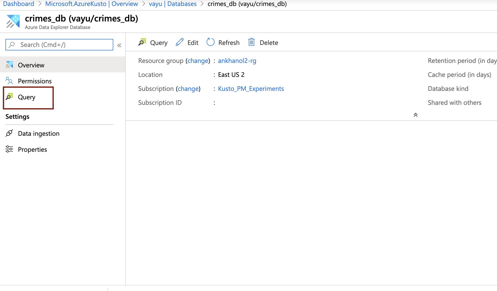
 

 

### 14. Click on "Open in Web UI"
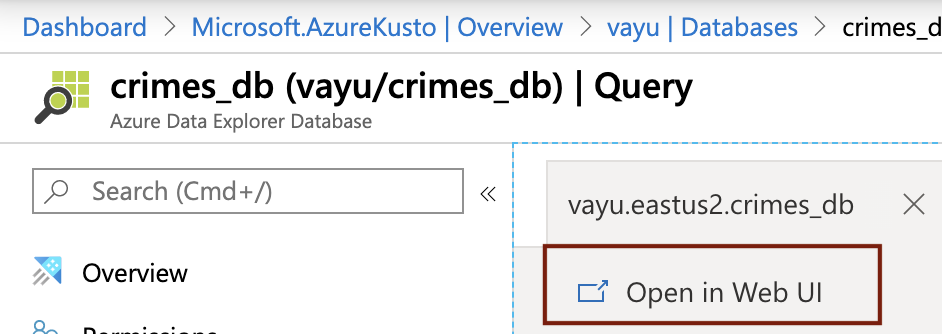
 

 

### 14. Search for "Storage Account"
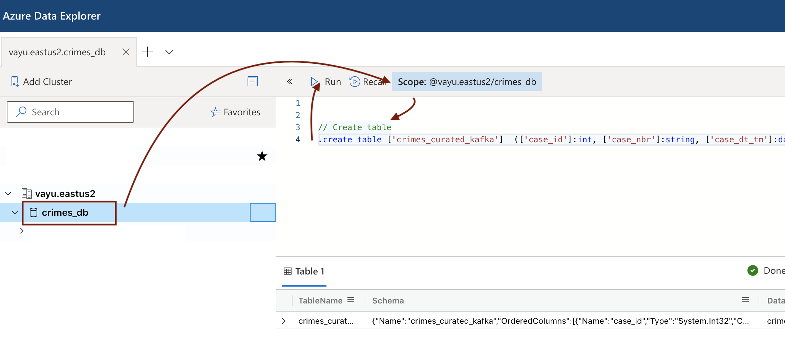
 

 

### 15. Search for "Storage Account"

 

 

### 16. Search for "Storage Account"
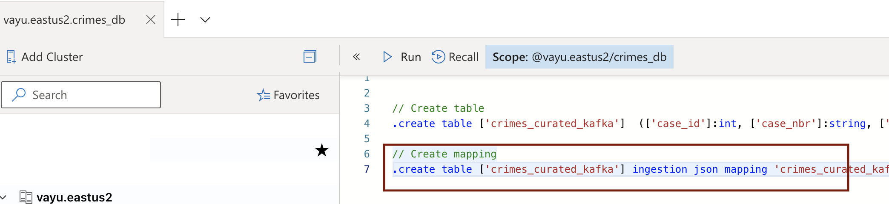
 

 

### 17. Search for "Storage Account"
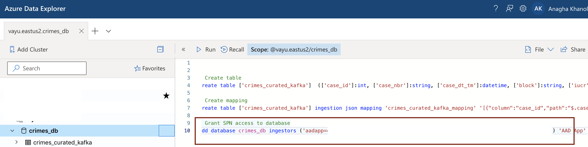
 

 

This concludes the module. 
[Return to the menu](https://github.com/anagha-microsoft/adx-kafkaConnect-hol/tree/master/hdi-standalone-nonesp#lets-get-started)
