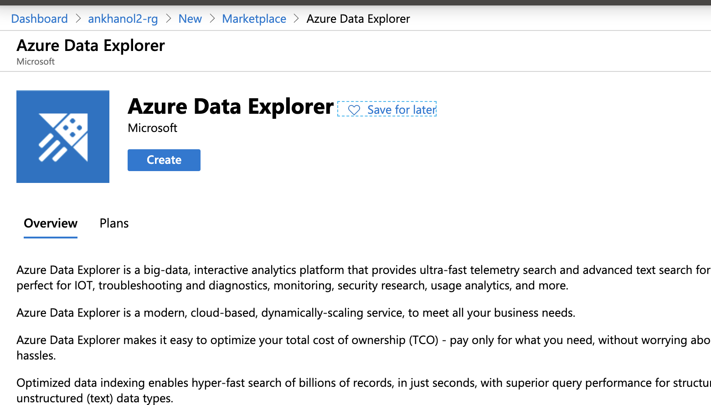
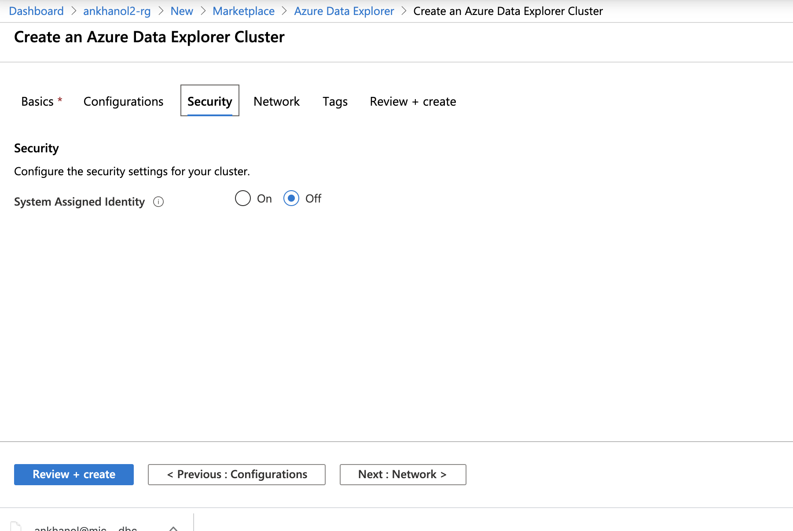
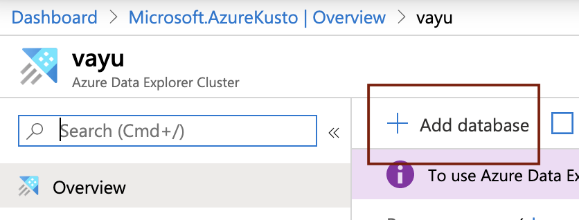
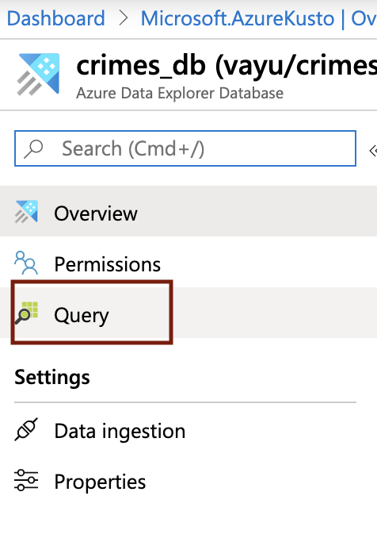

# About

This module covers provisioning an Azure Data Explorer, creating database objects required for the lab and granting permissions.  Navigate to your resource group, and click on "Add" and follow the steps below. 

### 1. Search for "Azure Data Explorer"

 

 

### 2. Click create

 

 

### 3. Enter details

 

 

### 4. Search for "Storage Account"

 

 

### 4. Search for "Storage Account"

 

 

### 5. Search for "Storage Account"

 

 

### 6. Search for "Storage Account"

 

 

### 7. Search for "Storage Account"

 

 

### 8. Search for "Storage Account"

 

 

### 9. Search for "Storage Account"

 

 

### 10. Search for "Storage Account"

 

 

### 11. Search for "Storage Account"

 

 

### 12. Search for "Storage Account"

 

 

### 13. Search for "Storage Account"

 

 

### 14. Search for "Storage Account"

 

 

### 15. Search for "Storage Account"

 

 

### 16. Search for "Storage Account"

 

 

### 17. Search for "Storage Account"

 

 

This concludes the module. 
[Return to the menu](https://github.com/anagha-microsoft/adx-kafkaConnect-hol/tree/master/hdi-standalone-nonesp#lets-get-started)
