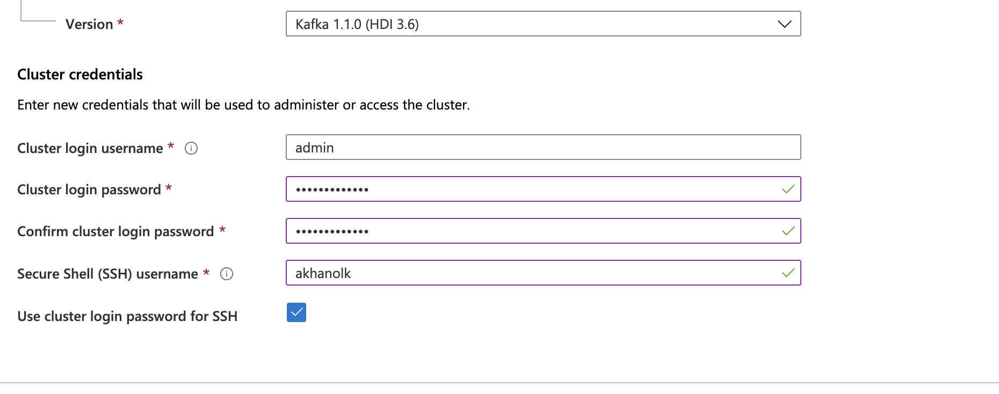
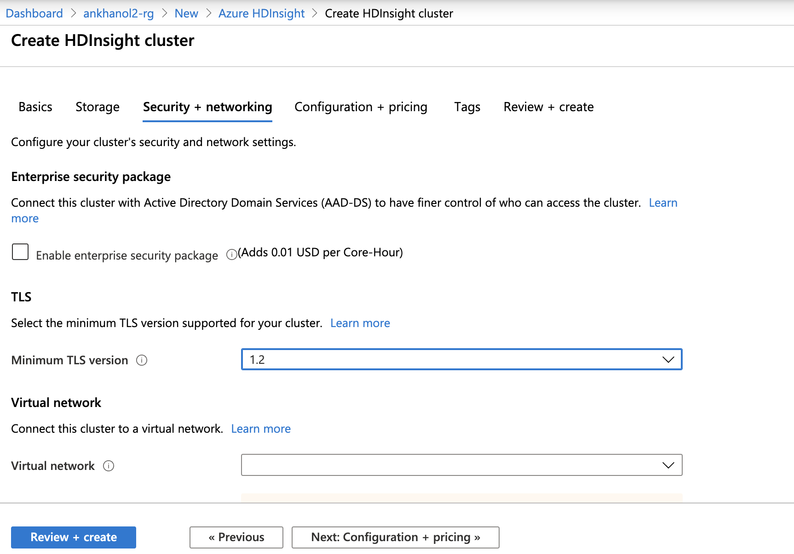
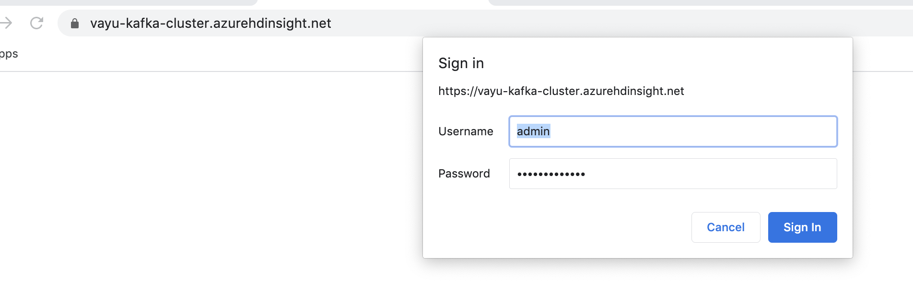
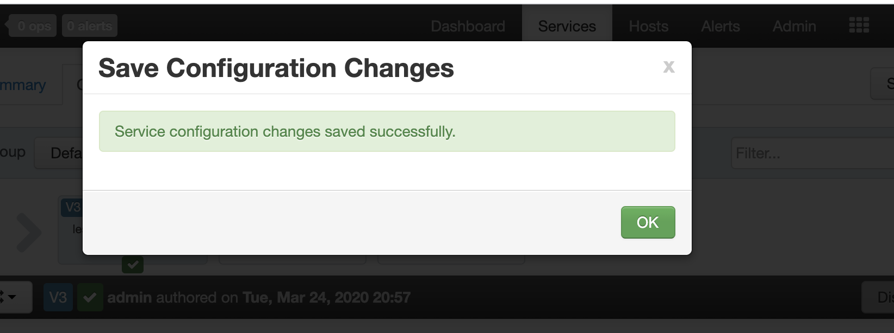
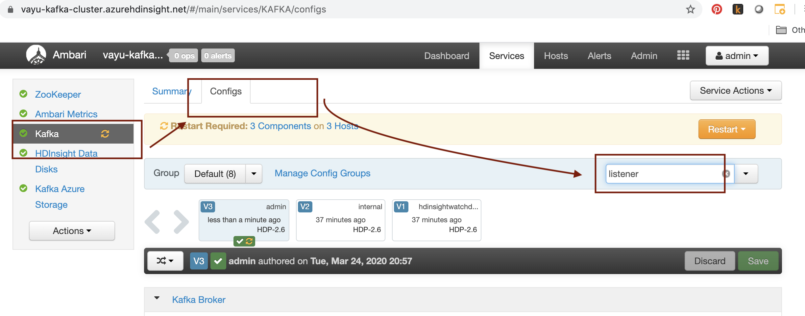

# About

This module covers provisioning a HDInsight cluster.  Navigate to your resource group, and click on "Add" and follow the steps below. 

### 1. Search for "Azure HDInsight"

 

 

### 2. Click create

 

 

### 3. Enter details, click on cluster type, select Kafka

 

 

### 4. Enter credentials

 

 

### 5. 

 

 

### 5. 

 

 

### 5. 

 

 

### 6. 

 

 

### 7. 

 

 

### 8. 

 

 

### 9. 

 

 

### 10. 

 

 

### 11. 

 

 

### 12. 

 

 

### 13. 

 

 

### 14. 

 

 

### 15. 

 

 

### 16. 

 

 

### 17. 

 

 

### 18. 

 

 

### 19. 

 

 

### 20. 

 

 

### 21. 

 

 

### . 

 

 

### . 

 

 

### . 

 

 

### . 

 

 

### . 

 

 

### . 

 

 

### . 

 

 

This concludes the module. 
[Return to the menu](https://github.com/anagha-microsoft/adx-kafkaConnect-hol/tree/master/hdi-standalone-nonesp#lets-get-started)
