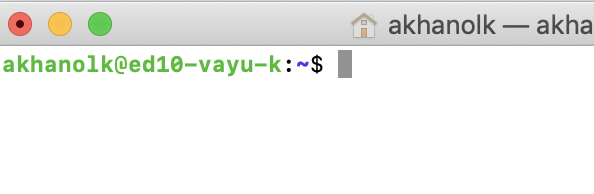

# About

This module covers creating a Kafka topic that we will publish events to.  
Switch to your SSH terminal, where you logged into the edge node.


### 1. SSH to the edge node


<br>
<hr>
<br>

### 2. Create a variable and populate it with the cluster name
```
read -p "Enter the Kafka on HDInsight cluster name: " CLUSTERNAME
```
Enter the cluster name at the prompt, and then echo the variable to ensure it has the right value.


<br>
<hr>
<br>

### 2. Enter details

<br>
<hr>
<br>

### 3. Agree to terms and click on purchase

<br>
<hr>
<br>

### 4. Monitor the provisioning to completion

<br>
<hr>
<br>

### 5. When it completes, it should look like this

<br>
<hr>
<br>

### 6. Switch back to Ambari, click on hosts

<br>
<hr>
<br>


This concludes the module.<br>
[Return to the menu](https://github.com/anagha-microsoft/adx-kafkaConnect-hol/tree/master/hdi-standalone-nonesp#lets-get-started)
