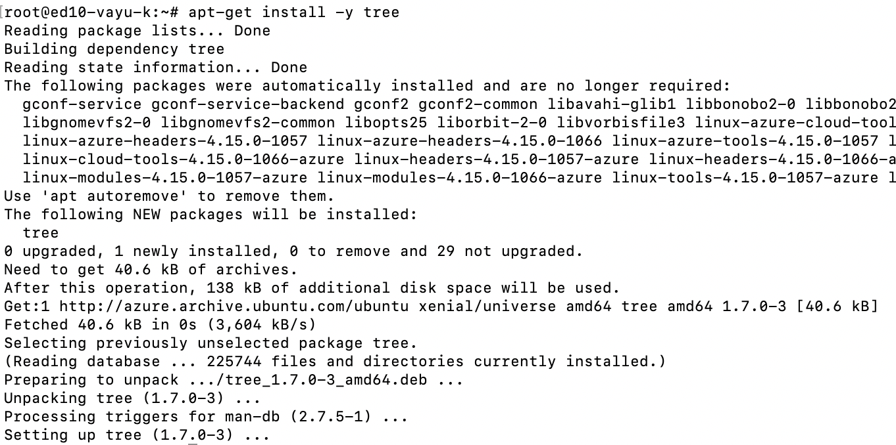

# About

This module covers downloading and configuring KafkaConnect for ADX and launching the service. 
<br>

### 1. SSH to the edge node ands switch to root


<br>
<hr>
<br>


<br>
<hr>
<br>

### 2. Install tree

```
apt-get install -y tree
```


<br>
<hr>
<br>

### 3. Create directory path for KafkaConnect jar download

```
 mkdir -p opt/kafka-connect-kusto
```

```
 tree opt
```


<br>
<hr>
<br>

### 4. Change to the directory created and download the jar

```
cd opt/kafka-connect-kusto
```

```
wget "https://github.com/Azure/kafka-sink-azure-kusto/releases/download/v0.3.2/kafka-sink-azure-kusto-0.3.2-jar-with-dependencies.jar"
```


<br>
<hr>
<br>

### 5. Rename the jar to have the prefix of 'kafka-connect'.  This is important because the default scripts that execute KafkaConnect search for jars starting with this name.

```
ls -al
```

```
mv kafka-sink-azure-kusto-0.3.2-jar-with-dependencies.jar kafka-connect-kusto-sink-0.3.2-uber.jar
```


<br>
<hr>
<br>


<br>
<hr>
<br>

### 6. Make the jar executable

```
chmod +x kafka-connect-kusto-sink-0.3.2-uber.jar 
```


<br>
<hr>
<br>

### 7. Copy the jar to the two directory paths (till we can reconcile to one path)

1.  Copy to /usr/hdp/current/kafka-broker/libs/

```
cp kafka-connect-kusto-sink-0.3.2-uber.jar /usr/hdp/current/kafka-broker/libs/
```

```
ls -al /usr/hdp/current/kafka-broker/libs/ | grep kusto
```


<br>
<hr>
<br>

2.   Copy to /usr/share/java/

```
cp kafka-connect-kusto-sink-0.3.2-uber.jar /usr/share/java/
```

```
ls -al /usr/share/java/ | grep kusto
```


<br>
<hr>
<br>


This concludes the module.<br>
[Return to the menu](https://github.com/anagha-microsoft/adx-kafkaConnect-hol/tree/master/hdi-standalone-nonesp#lets-get-started)
