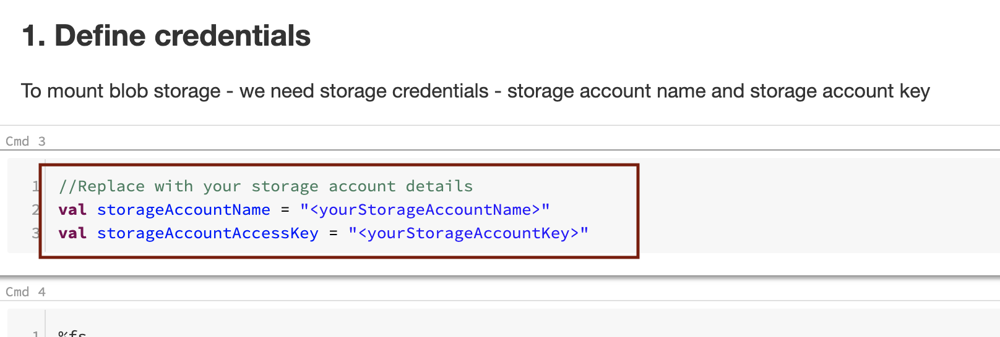

# About

Databricks has a disaggregated compute and storage model.  We will leverage the blob storage we created as the storage layer. 

### 1. Click on workspace and then on shared, then your name, and finally the down arrow

 

 

### 2. Click on import

 

 

### 3.Click on URL

 

 

This concludes the module. 
[Return to the menu](https://github.com/anagha-microsoft/adx-kafkaConnect-hol/tree/master/hdi-standalone-nonesp#lets-get-started)
