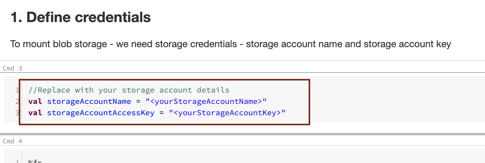
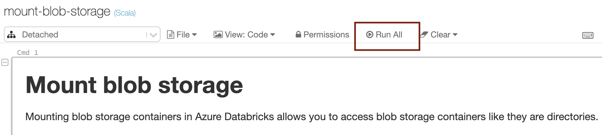
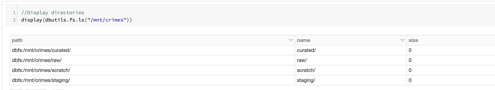

# About

This module covers streaming curated Chicago crimes to Kafka 

### 1. Define credentials

 

 

### 2. Click on 'Run All'

 

 

### 3.Navigate to the cell as shown below and if everything has been configured and executed correctly, you should see the directory listing

 

 

This concludes the module. 
[Return to the menu](https://github.com/anagha-microsoft/adx-kafkaConnect-hol/tree/master/hdi-standalone-nonesp#lets-get-started)
