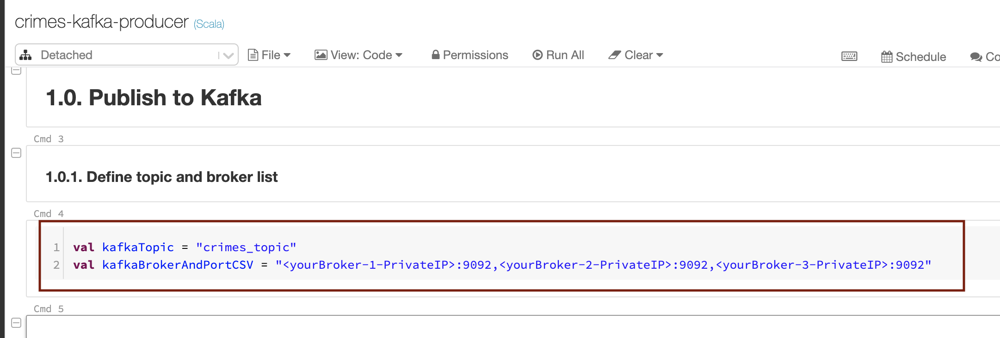
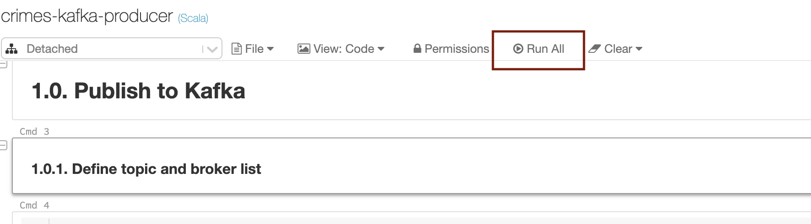
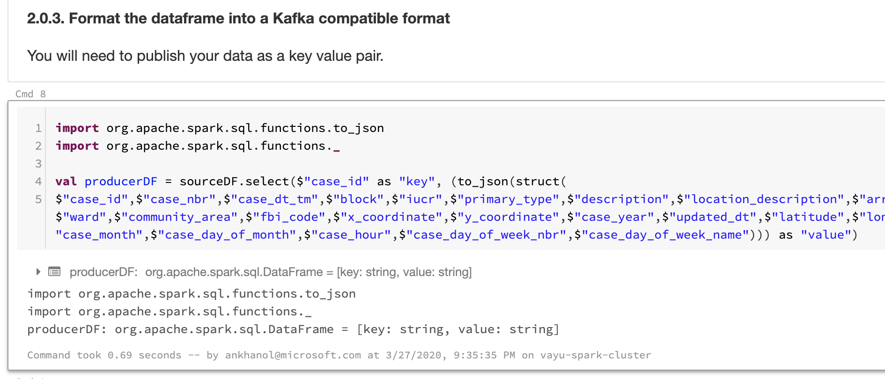
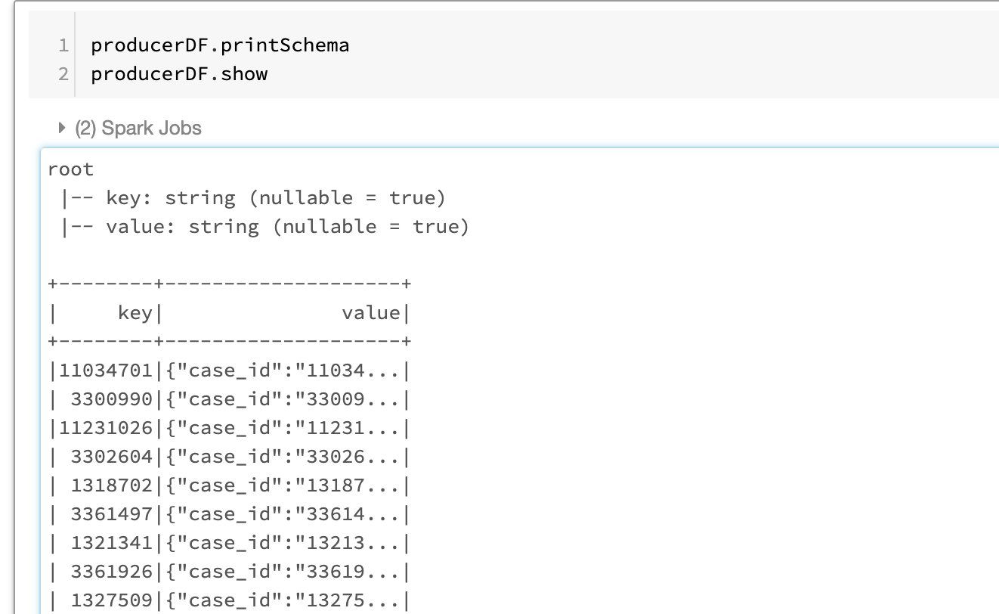
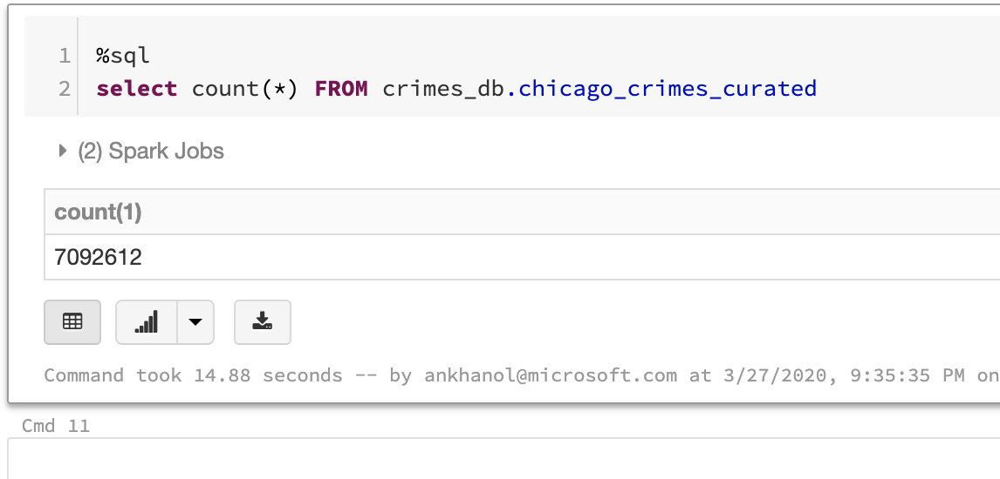
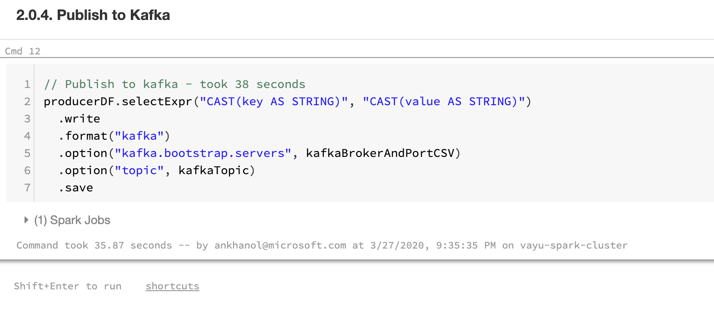

# About

This module covers publishing curated Chicago crimes to Kafka 

### 1. 

 

 

### 2. 

 

 

### 3.

 

 

### 4.

 

 

### 5.

 

 

### 6.

 

 

### 7.

 

 

This concludes the module. 
[Return to the menu](https://github.com/anagha-microsoft/adx-kafkaConnect-hol/tree/master/hdi-standalone-nonesp#lets-get-started)
