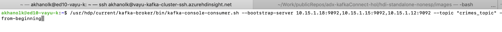
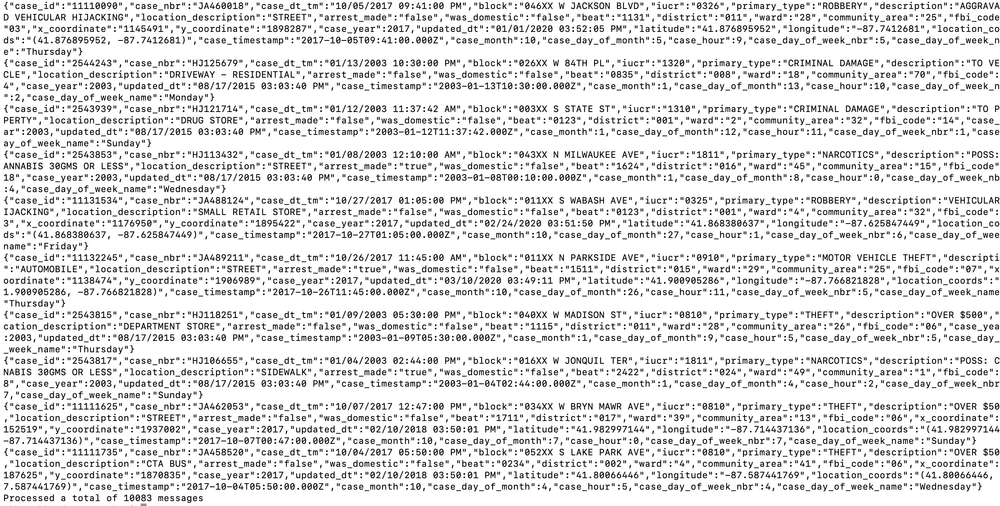

# About

This module covers validating that the Kafka topic indeed has events published to it from the previous module.  Switch to your Kafka edge node, we will run the Kafka console consumer to validate.<br>


### 1. Run the Kafka console consumer against the topic and stop right away

```
/usr/hdp/current/kafka-broker/bin/kafka-console-consumer.sh --bootstrap-server $KAFKABROKERS --topic "iot_telemetry_in" --from-beginning
```


<br>
<hr>
<br>

### 2. You should see some events on the screen


<br>
<hr>
<br>


This concludes the module.<br>
[Return to the menu](https://github.com/anagha-microsoft/adx-kafkaConnect-hol/tree/master/hdi-standalone-nonesp#lets-get-started)
