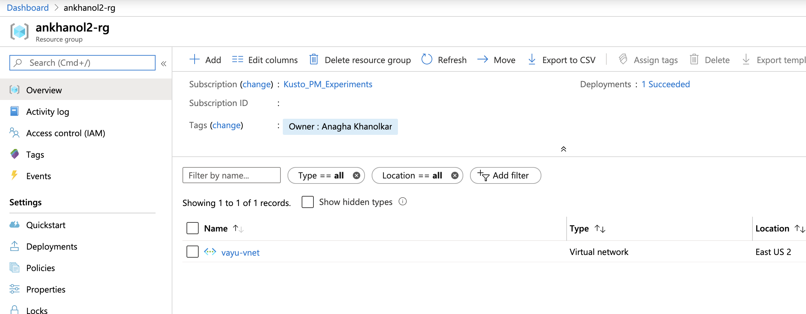

# About

This module covers provisioning of a virtual network with subnets

## 1.  Provision a virtual network with subnets

Navigate to your resource group 

### 1.1. Click on resource group

 

 

### 1.2. Click on resource group

 

 

### 1.3. Click on resource group

 

 

### 1.4. Click on resource group

 

 

### 1.5. Click on resource group

 

 
