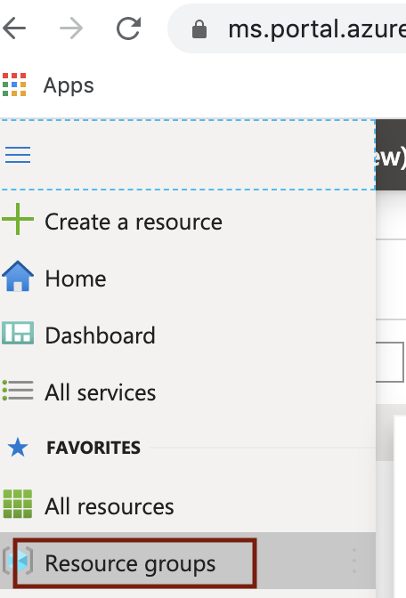
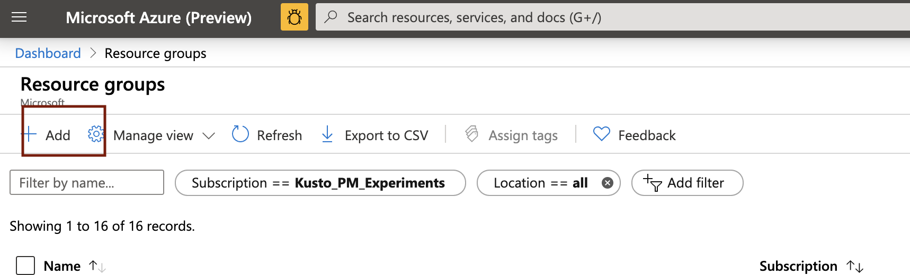
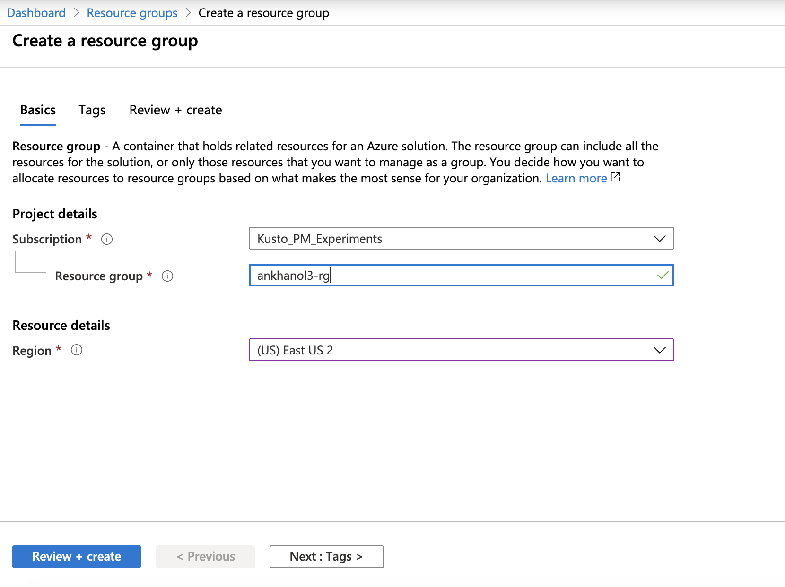
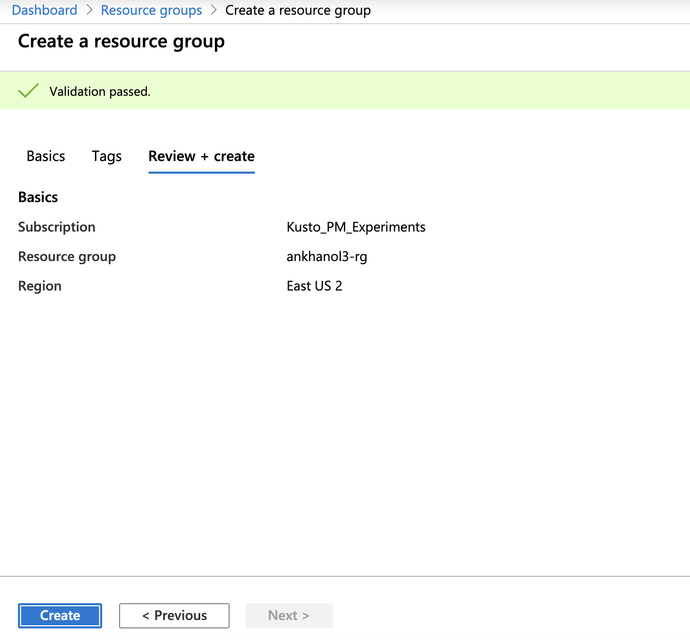
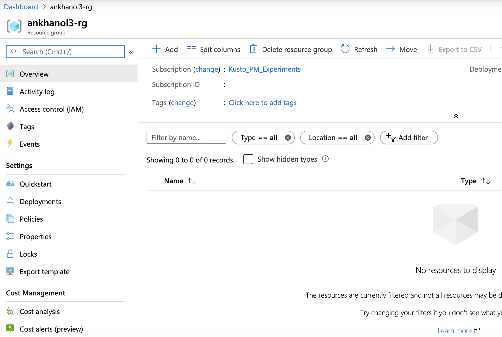

# About

This module covers:
1.  Provisioning of an Azure resource group
2.  Provisioning of a virtual network with subnets
3.  Provisioning of a storage account, creating containers, and capturing storage account key for subsequent use
4.  Creating an Azure Active Directory (AAD) Service Principal (SPN), creating a secret, capturing tenant ID, SPN app ID, SPN secret for subsequent use

## 1.  Provision an Azure resource group
Go to portal.azure.com, login and follow the steps below to create a resource group.
 

### 1.1. Click on resource group

 

 

### 1.2. Click on "Add"

 

 

### 1.3. Enter details

 

 

### 1.4. Click on "Create"

 

 

## 1.5. The resource group should get created

 

 

## 2.  Provision a virtual network with subnets

Navigate to your resource group 

### 2.1. Click on resource group

 

 

### 2.2. Click on resource group

 

 

### 2.3. Click on resource group

 

 

### 2.4. Click on resource group

 

 

### 2.5. Click on resource group

 

 
