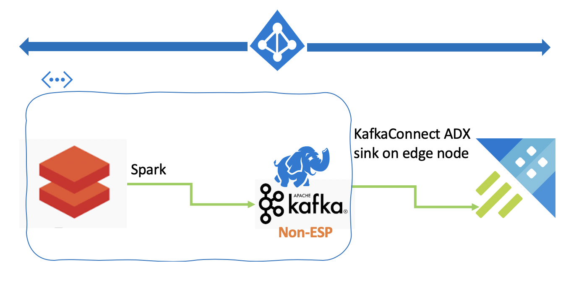

# Azure Data Explorer - Kafka Integration Hands On Lab
## With HDI Kafka, and standalone KafkaConnect on an edge node

## 1. About
The focus of this hands-on-lab is to demonstrate how to configure KafkaConnect sink in a standalone mode, on Azure HDInsight Kafka PaaS, to sink to Azure Data Explorer (ADX).  The lab is fully "scripted" (its not a hack, no bing/googling required) - there are detailed, step by step, and comprehensive instructions and is intended to demonstrate the integration. It includes four distributed PaaS offerings - Azure storage v2, HDInsight Kafka and Azure Data Explorer, and Azure Databricks.
  
We will download the Chicago crimes public dataset for this exercise 
https://data.cityofchicago.org/Public-Safety/Crimes-2001-to-present/ijzp-q8t2

## 2. Pre-requisites
- An Azure subscription with about $200 in funds
- About 8-10 hours of time
- Maybe some caffeine and some music
- Focus - there are a lot of steps, that need to be completed in sequential order and one step missed could be problematic for dependent steps
- Prior knowledge of Kafka, Spark, ADX and Azure, and the services in scope is not mandatory, but VERY helpful and may reduce the lab execution time to 2 hours

## 3. Solution pictorial overview

## What's covered in the lab

### Common:
1.  Provisioning an Azure resource group
2.  Provisioning a virtual network with subnets 
3.  Provisioning a storage account, and creating containers, and capturing storage account key for subsequent use
4.  Creating an Azure Active Directory (AAD) Service Principal (SPN), creating a secret, capturing tenant ID, SPN app ID, SPN secret for subsequent use

### Azure Data Explorer:
5.  Provisioning an ADX cluster
6.  Creating an ADX database, table and mapping reference
7.  Granting the AAD SPN, "ingestor" RBAC to the table 

### HDInsight Kafka:
8.  Provisioning a HDInsight Kafka cluster
8.  Provisioning an edge node on the Kafka cluster on which we will run KafkaConnect service
9.  Creating a Kafka topic in HDInsight
10. Configuring Kafka to broadcast IP addresses and configuring listener
11. Downloading KafkaConnect ADX sink jar on the edge node, copying it to the right location
12. Editing connect-standalone.properties with the broker:port list, and the plugin path to reflect the path the jar is located
13. Creating a kafka-connect-kusto.properties file with details about the sink (ADX conf)
14. Launching the KafkaConnect service

### Azure Databricks:
15. Provisioning an Azure Databricks cluster
16. Importing Spark scala code for the lab from git into your Databricks workspace
16. Mounting blob storage on the cluster
17. Downloading the Chicago crimes dataset to the raw information zone ("raw" container)
18. Curating the dataset (augmenting with temporal attributes and such) and persisting to the curated information zone ("curated" container)
19. Basic visualization in Spark (we will repeat this in Azure Data Explorer dashboard as well)
20. Stream read the Chicago crimes dataset from the curated information zone, and publish it to Kafka

### Azure Data Explorer:
21. Validate receipt of data from Kafka
22. Run some queries
23. Launch ADX dashboard and repeat #19

### Want a challenge?
24. Author a Spark notebook to publish the raw data to Kafka, and from there sink to a new ADX table defined for the raw data
25. Perform the transformations done in the Spark notebook in #18, in ADX
26. Create a new dashboard based off of the raw data that you curated in ADX

